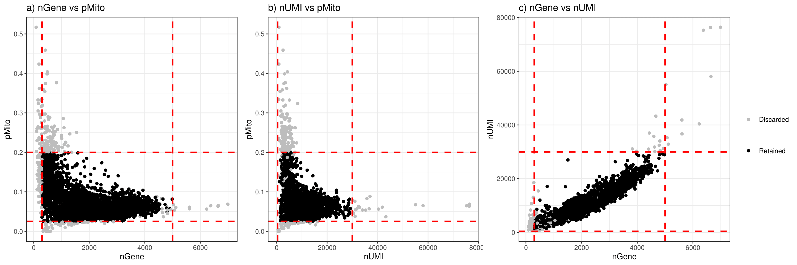
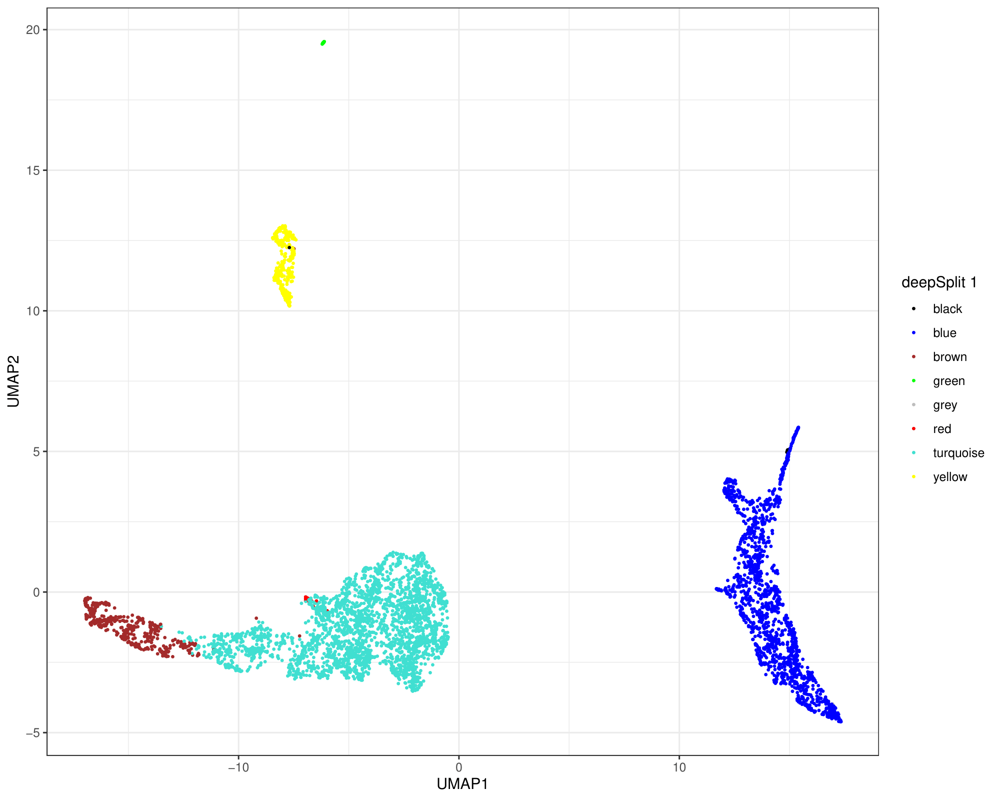
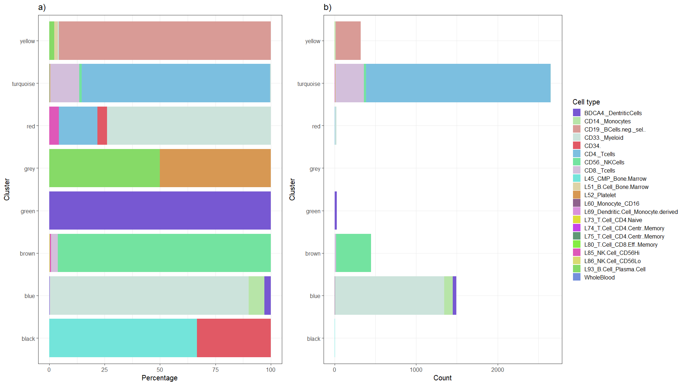
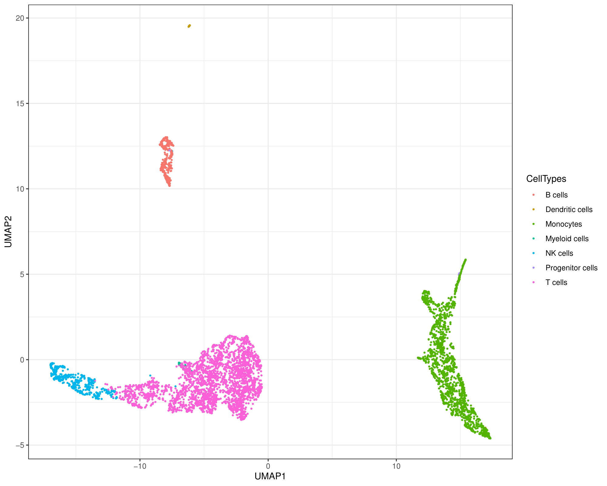
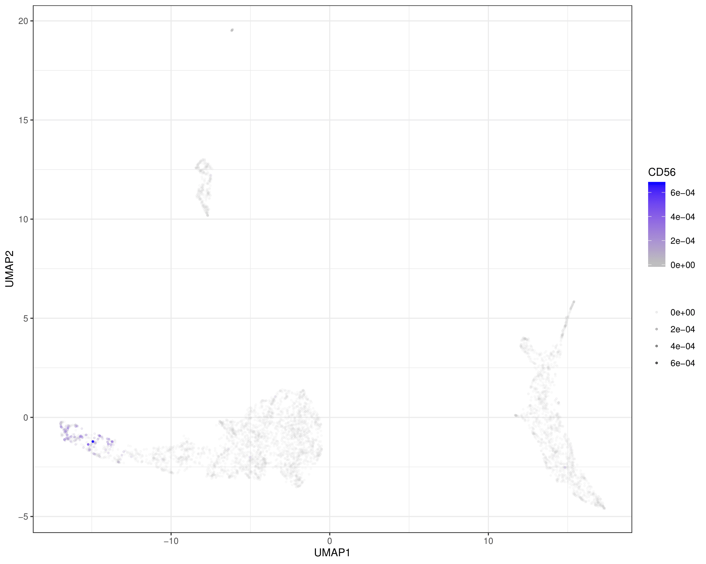
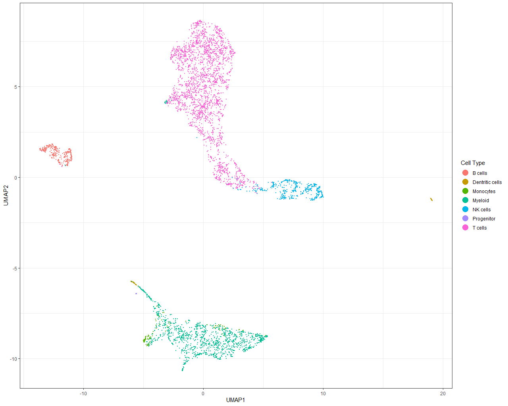
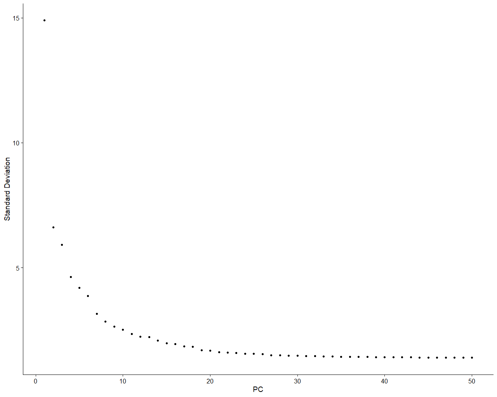
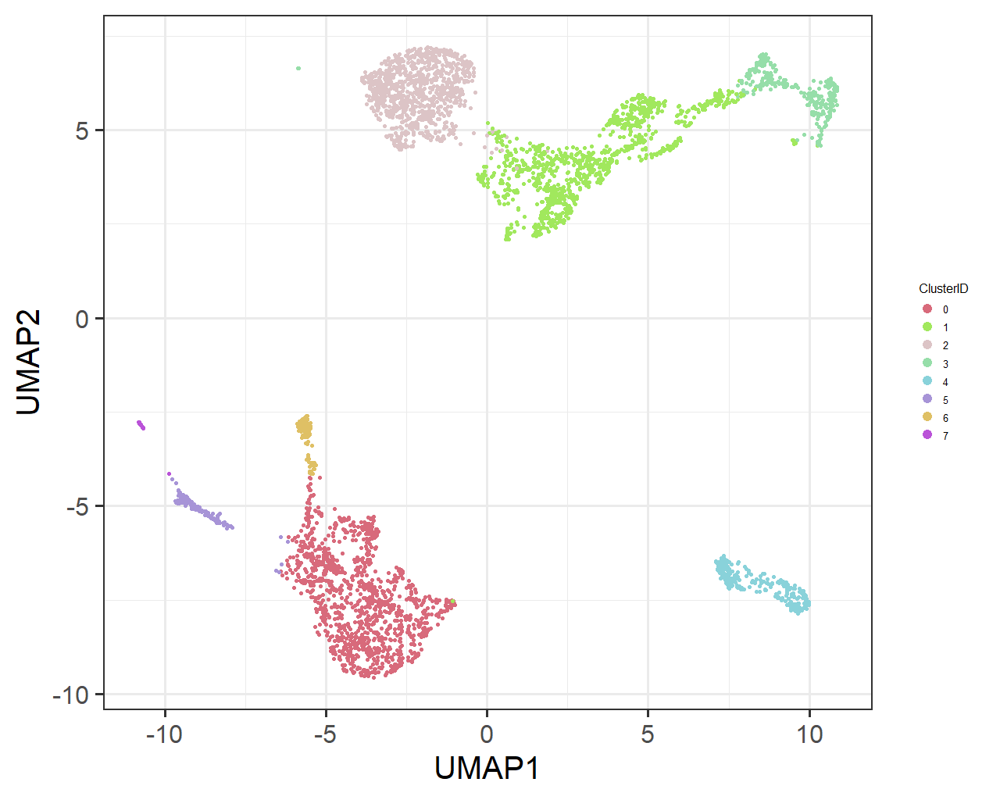
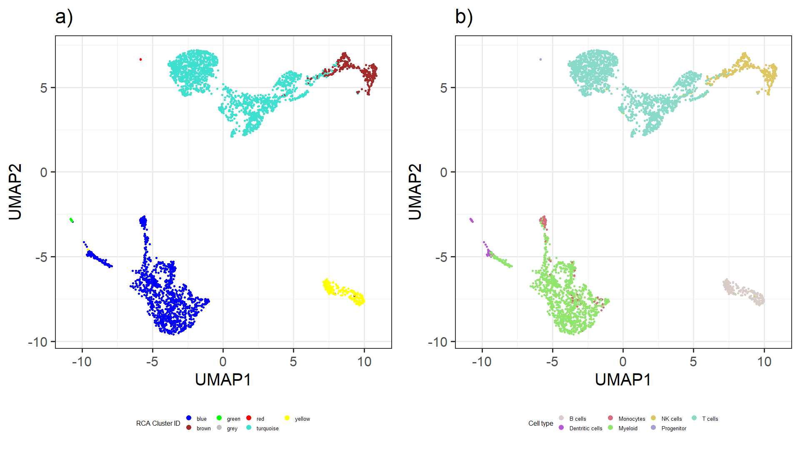

# RCA version 2.0
RCA, (Reference Component Analysis), is a computational approach for robust cell type annotation of single cell RNA sequencing data (scRNAseq). 
It is developed by the Prabhakar lab at the Genome Institute of Singapore (GIS). 
The original version of RCA is published in Nature Genetics (doi: 10.1038/ng.3818, Li et al., 2017).

## Release notes
Version 2.0 
Release date: September 3, 2019

## Functionality of RCA
Features: 
* clustering analysis of scRNAseq data from Human samples
* Provided reference panels:
  * "GlobalPanel": default option for clusterig general single cell data sets that include a wide spectrum of cell types.          
  * "ColonEpitheliumPanel": suitable for analyzing human colon/intestine derived samples.


## A beginner's guide to RCA
This guide will walk you through installing RCA and will showcase a exemplary analysis of publicly available scRNA-seq data from *10X Genomics*.
If you are using the *Seurat* R-package already and want to stick to that, we suggest you to look at the Section *Combining Seurat and RCA*. 
Further details on parameters and function of the mentioned R functions are provided in the R help
### Install the RCA R-package
Before you try to install RCA make sure that your R-version is at least R 3.5.0.
You can directly install RCA from github using the commands:

```{r}
library(remotes)
install_github("prabhakarlab/RCAv2")
```

The current release of RCA requires the following packages to be available on your system:
* remotes
* Matrix
* qlcMatrix
* WGCNA
* fastcluster
* BiocManager
* ggplot2
* gridExtra
* dplyr
* ComplexHeatmap
* circlize
* umap
* ggpubr

All missing CRAN-packages can be *automatically installed* during the RCA installation.
Note that the *HiClimR* package is optional, it allows to speed up the computationally expensive steps. Also the
*randomColoR* package is optional, it is useful to obtain distinguishable colors.

### Load the package
After installation, load the package with the command
```{r}
library("RCAv2")
```

### Generate a RCA object from scRNA-seq data
In this example, we consider a publicly available PBMC dataset generated by [10X Genomics](https://support.10xgenomics.com/single-cell-gene-expression/datasets/3.0.2/5k_pbmc_protein_v3).
We assume the data is [downloaded](http://cf.10xgenomics.com/samples/cell-exp/3.0.2/5k_pbmc_protein_v3/5k_pbmc_protein_v3_raw_feature_bc_matrix.tar.gz), unpacked and stored in the folder *10xPBMCs*, which should be placed in the working directory.

We generate a RCA object called **PBMCs** using the function *createRCAObjectFrom10X* by providing the path to the data.
```{r}
PBMCs<-RCAv2::createRCAObjectFrom10X("10xPBMCs/")
```

The resulting RCA object has its own print function providing basic information on the data
```{r}
PBMCs
```

	RCA reference class object
	Raw data: 5247 cells and 33570 features.

### Perform basic QC steps and data normalization
Quality control can performed directly within RCA. We use the command

```{r}
PBMCs<-RCAv2::dataFilter(PBMCs,
                  nGene.thresholds = c(300,5000), 
                  nUMI.thresholds = c(400,30000),
                  percent.mito.thresholds = c(0.025,0.2),
                  min.cell.exp = 3,
                  plot=T,
                  filename = "PBMCs_filter_example.pdf")
```

to filter the raw data according to
* the number of detected genes (*nGene.thresholds*)
* the number of unique molecular identifiers (*nUMI.thresholds*)
* the percentage of mitochondrial reads (*percent.mito.thresholds*)
* the minimum number of cells any gene needs to be expressed (*min.cell.exp*)


For easy interpretation of the data, the *dataFilter* function automatically generates a graphical representation of various QC metrics: 



Plotting can be disabled using the *plot* option.

Interrogating the R-object with

```{r}
PBMCs
```

tells us that the RCA object now holds both the intial unfiltered data as well as the data after QC.

	RCA reference class object
	Raw data: 5247 cells and 33570 features.
	Filtered data: 4973 cells and 17120 features.

Upon filtering, we can normalize the data by sequencing depth and log transform it:

```{r}
PBMCs<-RCAv2::dataLogNormalise(PBMCs)
```

### Compute a projection to a reference data set
To project the single-cell RNA-seq data against a reference, we use the *dataProject* function:

```{r}
PBMCs<-RCAv2::dataProject(PBMCs,
                     method = "GlobalPanel",
                     corMeth = "pearson")
```

The method parameter specifies the reference panel to be used. In this example, we use the *GlobalPanel* which is the original RCA panel used by Li et al. (Nat Genet, 2017).
The correlation with the reference panel and the single-cell data is assessed using Pearson correlation, as indiciated by the *corMeth* option.
Upon calling the *dataProject* function, the PBMCs object has been extended:

```{r}
PBMCs
```

	RCA reference class object
	Raw data: 5247 cells and 33570 features.
	Filtered data: 4973 cells and 17120 features.
	Projection data: 4973 cells to 179 cell-types

RCAv2 directly allows the user to utilize any custom panel. A user generated panel **has to** have a distinct structure:
* the panel has to be a R *data.frame* that is stored in *RDS* format,
* row names of the *data.frame* are gene names that match the gene names present in the RNA-seq data,
* column names of *data.frame* are cell-type/tissue names,

To use the custom panel *MyPanel.RDS* use the following command: 

```{r}
PBMCs<-RCAv2::dataProject(PBMCs,
                     method = "Custom",
		     customPath = "MyPanel.RDS",
                     corMeth = "pearson")
```

### Cluster the projection and visualize it
The projected data can be clustered using the command:
```{r}
PBMCs<-RCAv2::dataClust(PBMCs)
```
The clustering can be influenced by the parameters *deepSplitValues* and *minClustSize*, indicating the deepness of the cut in the clustering and the minimum number of cells within a cluster, respectively. 

RCA offers a heatmap plotting function using the *ComplexHeatmap* package:

```{r}
RCAv2::plotRCAHeatmap(PBMCs,filename = "Heatmap_PBMCs.pdf")
```

The heatmap can be used to manually assign cell-types based on the projection.


In addition to the visuzalization in the heatmap, it can make sense to look at the projection using a UMAP.
To do so, simple use the function

```{r}
RCAv2::plotRCAUMAP(PBMCs,filename = "UMAP_PBMCs.pdf")
```
The *plotRCAUMAP* returns a list of *ggplot2* objects to allow for simple modification of the generated figures. 



To better understand the composition of each cluster we generate a stacked bar plot Figure using the *plotRCAClusterComposition* function:
```{r}
#Estimate the most probable cell type label for each cell
PBMCs<-estimateCellTypeFromProjection(PBMCs,confidence = NULL)
#Generate the cluster composition plot
RCAv2::plotRCAClusterComposition(PBMCs,filename="Cluster_Composition.pdf")
```


In a) we show the relative composition of each cluster and b) shows the absolute number of cells in each cluster. The color code indicates the most likely annotation of the cells.

Based on the heatmap as well as the stacked bar plots we can relabel the clusters according to the major cell type annotations:
```{r}
RCAcellTypes<-PBMCs$clustering.out$dynamicColorsList[[1]]
RCAcellTypes[which(RCAcellTypes=="blue")]<-"Monocytes"
RCAcellTypes[which(RCAcellTypes=="green")]<-"Dentritic cells"
RCAcellTypes[which(RCAcellTypes=="yellow")]<-"B cells"
RCAcellTypes[which(RCAcellTypes=="grey")]<-"B cells"
RCAcellTypes[which(RCAcellTypes=="brown")]<-"NK cells"
RCAcellTypes[which(RCAcellTypes=="turquoise")]<-"T cells"
RCAcellTypes[which(RCAcellTypes=="red")]<-"Myeloid cells"
RCAcellTypes[which(RCAcellTypes=="black")]<-"Progenitor cells"
```

Also, we generate a vector holding the expression of *CD56*, a common NK cell marker. The gene name of *CD56* is NCAM1.

```{r}
CD56Exp<-PBMCs$data[which(rownames(PBMCs$data)=="NCAM1"),]
```

We can use the RCA plot function to obtain two additional UMAPs that are labelled according to the cell types and the CD56 marker:

```{r}
RCAv2::plotRCAUMAP(PBMCs,cellPropertyList = list(CellTypes=RCAcellTypes,CD56=CD56Exp),filename = "UMAP_PBMCs.pdf")
```
Each UMAP will be stored in a separate *pdf* where the filename indicates which element from the *cellPropertyList* is depicted in the UMAP.





For numerical data, the dots are transparent for low values to avoid overplotting issues. In our example, we can see that *CD56* expression corresponds to the NK annotation.

### Clustering free analysis of the projection
Especially for very large datasets it can be challenging to cluster the projection. For these instances, RCA includes a clustering indepent cell-type assignment approach that is purely based on each cells z-score distribution.
A call to the function 
```{r}
PBMCs<-estimateCellTypeFromProjection(PBMCs,confidence = NULL)
```
will return the most likely cell type for each cell and save it in the PBMCs object. With the parameter *confidence* a threshold (between 0 and 1) can be imposed on the ratio between the two most likely cell-types. In uncertain cases, a cell will be labelled as unkown.

The above call results in the following cell type predictions:
```{r}
table(unlist(PBMCs$cell.Type.Estimate))

              BDCA4._DentriticCells                     CD14._Monocytes             CD19._BCells.neg._sel.. 
                                 69                                 108                                 307 
                      CD33._Myeloid                               CD34.                         CD4._Tcells 
                               1363                                   3                                2266 
                      CD56._NKCells                         CD8._Tcells                 L45_CMP_Bone.Marrow 
                                458                                 364                                   4 
             L51_B.Cell_Bone.Marrow                        L52_Platelet  
```

Slightly simplifying the annotation via
```{r}
#Retrieve annotation
SimplifiedAnnotation<-unlist(PBMCs$cell.Type.Estimate)
#Relabel it
SimplifiedAnnotation[which(SimplifiedAnnotation=="CD33._Myeloid")]<-"Myeloid"
SimplifiedAnnotation[which(SimplifiedAnnotation=="CD4._Tcells")]<-"T cells"
SimplifiedAnnotation[which(SimplifiedAnnotation=="CD8._Tcells")]<-"T cells"
SimplifiedAnnotation[which(SimplifiedAnnotation=="CD14._Monocytes")]<- "Monocytes"
SimplifiedAnnotation[which(SimplifiedAnnotation=="BDCA4._DentriticCells")]<-"Dentritic cells"
SimplifiedAnnotation[which(SimplifiedAnnotation=="L93_B.Cell_Plasma.Cell")]<- "B cells"
SimplifiedAnnotation[which(SimplifiedAnnotation=="L52_Platelet")]<-"Myeloid"
SimplifiedAnnotation[which(SimplifiedAnnotation=="L74_T.Cell_CD4.Centr..Memory")]<-"T cells"
SimplifiedAnnotation[which(SimplifiedAnnotation=="L51_B.Cell_Bone.Marrow")]<-"T cells"
SimplifiedAnnotation[which(SimplifiedAnnotation=="L75_T.Cell_CD4.Centr..Memory")]<-"T cells"
SimplifiedAnnotation[which(SimplifiedAnnotation=="L85_NK.Cell_CD56Hi")]<-"NK cells"
SimplifiedAnnotation[which(SimplifiedAnnotation=="CD34.")]<-"Progenitor"
SimplifiedAnnotation[which(SimplifiedAnnotation=="L45_CMP_Bone.Marrow")]<- "Progenitor"
SimplifiedAnnotation[which(SimplifiedAnnotation=="WholeBlood")]<- "Myeloid"
SimplifiedAnnotation[which(SimplifiedAnnotation=="L69_Dendritic.Cell_Monocyte.derived")]<- "Myeloid"
SimplifiedAnnotation[which(SimplifiedAnnotation=="L80_T.Cell_CD8.Eff..Memory")]<-"T cells"
SimplifiedAnnotation[which(SimplifiedAnnotation=="L60_Monocyte_CD16")]<- "Monocytes"
SimplifiedAnnotation[which(SimplifiedAnnotation=="L86_NK.Cell_CD56Lo")]<-"NK cells"
SimplifiedAnnotation[which(SimplifiedAnnotation=="L73_T.Cell_CD4.Naive")]<-"T cells"
SimplifiedAnnotation[which(SimplifiedAnnotation=="CD56._NKCells")]<-"NK cells"
SimplifiedAnnotation[which(SimplifiedAnnotation=="CD19._BCells.neg._sel..")]<- "B cells"
```
and plotting a new UMAP with
```{r}
umapFigures<-RCAv2::plotRCAUMAP(PBMCs,
                      cellPropertyList = list(`Cell Type`=SimplifiedAnnotation),
                      filename = "UMAP_PBMCs.pdf")
```
leads us to a clustering free cell type assignment.




## Combining RCA with Seurat
Data processing can also be carried out with Seurat. Here is an example how you can combine a RCA analysis with data preprocessed in Seurat.

### Load and preprocess data
Using the same 10x data as before, we generate a Seurat object and perform an initial analysis:

```{r}
library(Seurat)

#Load the data
PBMCs.10x.data<-Seurat::Read10X("../Downloads/10xExample/",)

#Generate a Seurat object
pbmc_Seurat <- CreateSeuratObject(counts = PBMCs.10x.data$`Gene Expression`, 
                  min.cells = 3, 
                  min.features  = 200, 
                  project = "10X_PBMC", 
                  assay = "RNA")

#Compute the percentage of mitochondrial rates
mito.genes<-grep(pattern="^MT-",x=rownames(pbmc_Seurat@assays[["RNA"]]),value=T)
percent.mito <- Matrix::colSums(pbmc_Seurat@assays[["RNA"]][mito.genes, ])/
                                Matrix::colSums(pbmc_Seurat@assays[["RNA"]])
pbmc_Seurat <- AddMetaData(object = pbmc_Seurat, metadata = percent.mito, col.name = "percent.mito")

#Perform QC using the same parameters as above
pbmc_Seurat <- subset(pbmc_Seurat, nFeature_RNA >300 & nFeature_RNA < 5000 &
                        nCount_RNA > 400 & nCount_RNA<30000 &
                        percent.mito > 0.025 & percent.mito < 0.2)

#Normalize the data
pbmc_Seurat <- NormalizeData(object = pbmc_Seurat, normalization.method = "LogNormalize", scale.factor = 10000)
```

To run RCA, no further processing steps would be needed. However, we want to also compare the RCA result to the Seurat based clustering, therefore we first go on with a Seurat based analysis:
```{r}

#Find HVGs
pbmc_Seurat <- FindVariableFeatures(object = pbmc_Seurat, 
                   mean.function = ExpMean, 
                   dispersion.function = LogVMR, 
                   x.low.cutoff = 0.0125, 
                   x.high.cutoff = 3, 
                   y.cutoff = 0.5, 
                   nfeatures = 2000)

#Center and scale the data
pbmc_Seurat <- ScaleData(object = pbmc_Seurat)

#Run PCA on the data
pbmc_Seurat <- RunPCA(object = pbmc_Seurat,  npcs = 50, verbose = FALSE)

#Plot different aspsects of the pca
ElbowPlot(object = pbmc_Seurat,ndims = 50)
```



Judging based on the Elbowplot shown above, we use 20 PCs for further analysis. 
```{r}
#Find Neighbors
pbmc_Seurat <- FindNeighbors(pbmc_Seurat, reduction = "pca", dims = 1:20)

#Find Clusters
pbmc_Seurat <- FindClusters(pbmc_Seurat, resolution = 0.2, algorithm = 1)
```

We generate a UMAP of the data stored in the Seurat object using the umap R package:
```{r}
#Load required libraries
library(umap)
library(ggplot2)
library(randomcoloR)

#Compute Umap from first 20PCs
umap_resultS<- umap(pbmc_Seurat@reductions$pca@cell.embeddings[,c(1:20)])
umap_resultSL<-as.data.frame(umap_resultS$layout)

#Derive distinguishable colors for the seurat clusters
myColors<-distinctColorPalette(length(unique(pbmc_Seurat$seurat_clusters)))

#Generate a UMAP
umapAll_Seurat_RCA<-ggplot(umap_resultSL,aes(x=V1,y=V2,color=pbmc_Seurat$seurat_clusters))+theme_bw(30)+
  geom_point(size=1.5)+labs(colour="ClusterID")+theme(legend.title = element_text(size=10))+
  guides(colour = guide_legend(override.aes = list(size=4)))+theme(legend.position = "right")+
  theme(legend.text=element_text(size=10))+scale_color_manual(values=myColors)+xlab("UMAP1")+ylab("UMAP2")
umapAll_Seurat_RCA
```
We obtain the following UMAP:


### Generate a RCA object and perform RCA analysis
We use the RCA function *createRCAObject* to generate a RCA object from the count data stored in our Seurat object.

```{r}
library(RCAv2)
RCA_from_Seurat<-RCAv2::createRCAObject(pbmc_Seurat@assays$RNA@counts)
```
Next, we can compute the projection, cluster the data, and estimate the most likely cell type for each cell as above:
```{r}
#Compute projection
RCA_from_Seurat<-RCAv2::dataProject(rca.obj = RCA_from_Seurat)

#Cluster the projection
RCA_from_Seurat<-RCAv2::dataClust(RCA_from_Seurat)

#Estimate most likely cell type
RCA_from_Seurat<-RCAv2::estimateCellTypeFromProjection(RCA_from_Seurat)
```

Using the RCA cell type labels, RCA and Seurat clusters, we generate two new UMAPs whose coordinates are based on the PCs derived from HVGs and that are colored according to RCA clusters and cell type labels.

```{r}
#Simplify the cell type annotation
SimplifiedAnnotation<-unlist(RCA_from_Seurat$cell.Type.Estimate)
SimplifiedAnnotation[which(SimplifiedAnnotation=="CD33._Myeloid")]<-"Myeloid"
SimplifiedAnnotation[which(SimplifiedAnnotation=="CD4._Tcells")]<-"T cells"
SimplifiedAnnotation[which(SimplifiedAnnotation=="CD8._Tcells")]<-"T cells"
SimplifiedAnnotation[which(SimplifiedAnnotation=="CD14._Monocytes")]<- "Monocytes"
SimplifiedAnnotation[which(SimplifiedAnnotation=="BDCA4._DentriticCells")]<-"Dentritic cells"
SimplifiedAnnotation[which(SimplifiedAnnotation=="L93_B.Cell_Plasma.Cell")]<- "B cells"
SimplifiedAnnotation[which(SimplifiedAnnotation=="L52_Platelet")]<-"Myeloid"
SimplifiedAnnotation[which(SimplifiedAnnotation=="L74_T.Cell_CD4.Centr..Memory")]<-"T cells"
SimplifiedAnnotation[which(SimplifiedAnnotation=="L51_B.Cell_Bone.Marrow")]<-"T cells"
SimplifiedAnnotation[which(SimplifiedAnnotation=="L75_T.Cell_CD4.Centr..Memory")]<-"T cells"
SimplifiedAnnotation[which(SimplifiedAnnotation=="L85_NK.Cell_CD56Hi")]<-"NK cells"
SimplifiedAnnotation[which(SimplifiedAnnotation=="CD34.")]<-"Progenitor"
SimplifiedAnnotation[which(SimplifiedAnnotation=="L45_CMP_Bone.Marrow")]<- "Progenitor"
SimplifiedAnnotation[which(SimplifiedAnnotation=="WholeBlood")]<- "Myeloid"
SimplifiedAnnotation[which(SimplifiedAnnotation=="L69_Dendritic.Cell_Monocyte.derived")]<- "Myeloid"
SimplifiedAnnotation[which(SimplifiedAnnotation=="L80_T.Cell_CD8.Eff..Memory")]<-"T cells"
SimplifiedAnnotation[which(SimplifiedAnnotation=="L60_Monocyte_CD16")]<- "Monocytes"
SimplifiedAnnotation[which(SimplifiedAnnotation=="L86_NK.Cell_CD56Lo")]<-"NK cells"
SimplifiedAnnotation[which(SimplifiedAnnotation=="L73_T.Cell_CD4.Naive")]<-"T cells"
SimplifiedAnnotation[which(SimplifiedAnnotation=="CD56._NKCells")]<-"NK cells"
SimplifiedAnnotation[which(SimplifiedAnnotation=="CD19._BCells.neg._sel..")]<- "B cells"

#Plot a umap colored by the simplified cell type labels
myColors<-distinctColorPalette(length(unique(SimplifiedAnnotation)))
umapAll_Seurat_Estimated_CT<-ggplot(umap_resultSL,
aes(x=V1,y=V2,color=SimplifiedAnnotation))+
theme_bw(30)+
geom_point(size=1.5)+
theme(legend.position = "bottom")+
labs(colour="Cell type")+
guides(colour = guide_legend(override.aes = list(size=4)))+
theme(legend.text=element_text(size=10))+
scale_color_manual(values=myColors)+
ggtitle("b)")+
xlab("UMAP1")+ylab("UMAP2")+
theme(legend.title = element_text(size=12))

#Plot a umap colored by the RCA cluster ID
umapAll_Seurat_RCA_Clusters<-ggplot(umap_resultSL,
aes(x=V1,y=V2,color=RCA_from_Seurat$clustering.out$dynamicColorsList[[1]]))+
theme_bw(30)+
geom_point(size=1.5)+
theme(legend.position = "bottom")+
labs(colour="RCA Cluster ID")+
guides(colour = guide_legend(override.aes = list(size=4)))+
theme(legend.text=element_text(size=10))+
xlab("UMAP1")+ylab("UMAP2")+
scale_color_identity(guide=guides(color=RCA_from_Seurat$clustering.out$dynamicColorsList[[1]]))+
ggtitle("a)")+
theme(legend.title = element_text(size=12))

#Combine the Figures into one
library(gridExtra)
grid.arrange(umapAll_Seurat_RCA_Clusters,umapAll_Seurat_Estimated_CT,nrow=1)
```



The RCA clusters show a high concordance to the Seurat clusters shown in the previous UMAP.

### Add UMAP coordinates and annotations to the Seurat object
For greater convenience the results of RCA can be saved within the Seurat object for further analysis.

```{r}
pbmc_Seurat[["RCA.clusters"]]<-RCA_from_Seurat$clustering.out$dynamicColorsList
pbmc_Seurat[["cellTypeLabel"]]<-RCA_from_Seurat$cell.Type.Estimate
pbmc_Seurat[["Projection"]]<-CreateAssayObject(data=RCA_from_Seurat$projection.data)
```

## FAQ
**What is the difference between the original RCA version (Li et al., Nat Genet, 2017) and RCA version 2?**

*RCA version 2 improves upon version 1 in terms of performance, applicability, functionality and usability. We reimplented the algorithm more efficiently and use faster packages. We considerably extended the included reference data sets and provide new ways of cluster free cell type annotation for large data sets. Also the automated generation of figures has been improved to scale better with the size of current data sets.*

**The clustering is very slow (or it doesn't work at all), what can I do?**

*First make sure you are indeed using RCA version 2. Secondly you may check whether you can install the HiClimR package for more a more memory efficient clustering algorithm. Also consider to run RCA on a compute cluster or in the cloud using a machine with large main memory. For very big data sets, consider to omit the clustering and use the z-score based cell-type annotation and UMAP coloring introduced with RCA version 2.*

**The cell-type I am interested in are not part of the provided panels, can I generate and use my own reference data set in RCA?**

*Yes you can. Any custom panel can be considered in RCA. An example is shown above.*

**I do not have 10X data, can I just use a count matrix as input for RCA?**

*Yes, that is possible as well. You can generate a RCA object from a custom count matrix using. Guidelines are provided above (Compute a projection to a reference data set)*
