# RCA version 2.0
RCA (Reference Component Analysis) is a computational approach for robust cell type annotation of single cell RNA sequencing data (scRNAseq). 
It is developed by the Prabhakar lab at the Genome Institute of Singapore (GIS). 
The original version of RCA is published in Nature Genetics (doi: 10.1038/ng.3818, Li et al., 2017).

## Release notes
Version 2.0 
Release date: September 3, 2019

## Functionality of RCA
RCA takes scRNA-seq data as input. For 10X Genomics data processed with CellRanger, build in quality control and preprocessing functions are available. Other data sets that have been preprocessed elsewhere can be incorporated as a count matrix. Reference datasets that can be included in RCA include (sorted) bulk RNA-seq, microarray and scRNA-seq data sets. Within RCA, we provide a function that allows users to easily generate custom reference panels from raw count data. Additionally we provide several reference panels for human cell types as well as for mouse. RCA considers a selected reference panel as well as query single cell data to compute a correlation matrix indicating the similarity of single cell transcriptomes to the reference transcriptomes. This, so called, reference projection, can be clustered and visualized in a heatmap, and/or directly visualized in a UMAP. The most likely cell type can be calculated either per cell or per cluster.

An overview on all features of RCA is provided in the Figure below:


## A beginner's guide to RCA
This guide will walk you through installing RCA2 and will showcase a exemplary analysis of publicly available scRNA-seq data from *10X Genomics*.
If you are using the *Seurat* R-package already and want to stick to that, we suggest you to look at the Section *Combining Seurat and RCA*. 
Further details on parameters and function of the mentioned R functions are provided in the R help
### Install the RCA R-package
Before you try to install RCA make sure that your R-version is at least R 3.5.0. We have tested RCA on Windows, Linux and Mac devices up to R version 4.0.2.
You can directly install RCA from github using the commands:

```R
library(remotes)
install_github("prabhakarlab/RCAv2")
```

The current release of RCA requires the following packages to be available on your system:
* remotes
* Matrix
* qlcMatrix
* WGCNA
* fastcluster
* dbscan
* BiocManager
* ggplot2
* plotly
* plotrix
* gridExtra
* dplyr
* ComplexHeatmap
* circlize
* umap
* ggpubr
* irlba

All missing CRAN-packages can be *automatically installed* during the RCA installation.
Note that the *HiClimR*, package is optional, it allows to speed up the computationally expensive steps. Also the
*randomColoR* package is optional, it is useful to obtain distinguishable colors.
Further optional packages are *Seurat*, available from CRAN, and *clusterProfiler*, *enrichplot* as well as corresponding annotation libraries.

### Load the package
After installation, load the package with the command
```R
library("RCAv2")
```

### Generate a RCA object from scRNA-seq data
In this example, we consider a publicly available PBMC dataset generated by [10X Genomics](https://support.10xgenomics.com/single-cell-gene-expression/datasets/3.0.2/5k_pbmc_protein_v3).
We assume the data is [downloaded](http://cf.10xgenomics.com/samples/cell-exp/3.0.2/5k_pbmc_protein_v3/5k_pbmc_protein_v3_raw_feature_bc_matrix.tar.gz), unpacked and stored in the folder *10xPBMCs*, which should be placed in the working directory.

We generate a RCA object called **PBMCs** using the function *createRCAObjectFrom10X* by providing the path to the data.
```R
PBMCs<-RCAv2::createRCAObjectFrom10X("10xPBMCs/")
```

The resulting RCA object has its own print function providing basic information on the data
```R
PBMCs
```

	RCA reference class object
	Raw data: 5247 cells and 33570 features.

### Perform basic QC steps and data normalization
Quality control can performed directly within RCA. We use the command

```R
PBMCs<-RCAv2::dataFilter(PBMCs,
                  nGene.thresholds = c(300,5000), 
                  nUMI.thresholds = c(400,30000),
                  percent.mito.thresholds = c(0.025,0.2),
                  min.cell.exp = 3,
                  plot=T,
                  filename = "PBMCs_filter_example.pdf")
```

to filter the raw data according to
* the number of detected genes (*nGene.thresholds*)
* the number of unique molecular identifiers (*nUMI.thresholds*)
* the percentage of mitochondrial reads (*percent.mito.thresholds*)
* the minimum number of cells any gene needs to be expressed (*min.cell.exp*)


For easy interpretation of the data, the *dataFilter* function automatically generates a graphical representation of various QC metrics: 


Plotting can be disabled using the *plot* option.

Interrogating the R-object with

```R
PBMCs
```

tells us that the RCA object now holds both the intial unfiltered data as well as the data after QC.

	RCA reference class object
	Raw data: 5247 cells and 33570 features.
	Filtered data: 4973 cells and 17120 features.

Upon filtering, we can normalize the data by sequencing depth and log transform it:

```R
PBMCs<-RCAv2::dataLogNormalise(PBMCs)
```

### Compute a projection to a reference data set
To project the single-cell RNA-seq data against a reference, we use the *dataProject* function:

```R
PBMCs<-RCAv2::dataProject(PBMCs,
                     method = "GlobalPanel",
                     corMeth = "pearson")
```

The method parameter specifies the reference panel to be used. In this example, we use the *GlobalPanel* which is the original RCA panel used by Li et al. (Nat Genet, 2017).
The correlation with the reference panel and the single-cell data is assessed using Pearson correlation, as indiciated by the *corMeth* option.
Upon calling the *dataProject* function, the PBMCs object has been extended:

```R
PBMCs
```

	RCA reference class object
	Raw data: 5247 cells and 33570 features.
	Filtered data: 4973 cells and 17120 features.
	Projection data: 4973 cells to 179 cell-types

In addition to the *GlobalPanel*, RCA now provides *12* reference panels:

* *GlobalPanel* from the original RCA (Li et al., 2017) containing both primary cell types and tissues. Can be limited to only cell types with *"GlobalPanel_CellTypes*. 
* *ColonEpiPanel*: 9 colon epithelial samples from Li et al. (Nature genetics, 2017).
* *MonacoPanel*: 29 PBMC cell types from Monaco, G., et al. (Cell reports, 2019).
* *MonacoBCellPanel*: 5 B cell sub-types from Monaco, G., et al. (Cell reports, 2019).
* *MonacoMonoPanel*: 5 Monocyte sub-types from Monaco, G., et al. (Cell reports, 2019).
* *MonacoTCellPanel*: 15 T cell sub-types from Monaco, G., et al. (Cell reports, 2019).
* *CITESeqPanel* based on Seurat 4.0 containing 34 cell types.
* *ENCODEHumanPanel*: 93 human cell types from ENCODE.
* *NovershternPanel*: 15 PBMC cell types from Novershtern et al. (Cell, 2011).
* *NovershternTCellPanel*: 6 T cell sub-types from Novershtern et al. (Cell, 2011).
* *ENCODEMousePanel*: 15 mouse cell types from ENCODE.
* *ZhangMouseBrainPanel*: 7 mouse brain cell types from Tasic et al. (Nature neuroscience, 2016).


RCAv2 directly allows the user to utilize any custom panel. A user generated panel **has to** have a distinct structure:
* the panel has to be a R *data.frame* that is stored in *RDS* format,
* row names of the *data.frame* are gene names that match the gene names present in the RNA-seq data,
* column names of *data.frame* are cell-type/tissue names,

To use the custom panel *MyPanel.RDS* use the following command: 

```R
PBMCs<-RCAv2::dataProject(PBMCs,
                     method = "Custom",
		     customPath = "MyPanel.RDS",
                     corMeth = "pearson")
```

To benefit from multiple panels at the same time, users can exploit the *dataProjectMultiPanel* function:

```R
PBMCs<-RCAv2::dataProjectMultiPanel(PBMCs,method=list("NovershternPanel", "MonacoPanel", "GlobalPanel_CellTypes"),corMeth="pearson")
```

The *dataProjectMultiPanel* function projects cells by default against the *Novershtern*, the *Monaco* and cell types from the *Global panel*.

### Cluster the projection and visualize it
The projected data can be clustered using the command:
```R
PBMCs<-RCAv2::dataClust(PBMCs)
```
The clustering can be influenced by the parameters *deepSplitValues* and *minClustSize*, indicating the deepness of the cut in the clustering and the minimum number of cells within a cluster, respectively. 

RCA offers a heatmap plotting function using the *ComplexHeatmap* package:

```R
RCAv2::plotRCAHeatmap(PBMCs,filename = "Heatmap_PBMCs.pdf",var.thrs=1)
```

The heatmap can be used to manually assign cell-types based on the projection. Via the *var.thrs* parameter, the heatmap can be reduced to show only cell-types with the indicated degree of variation.

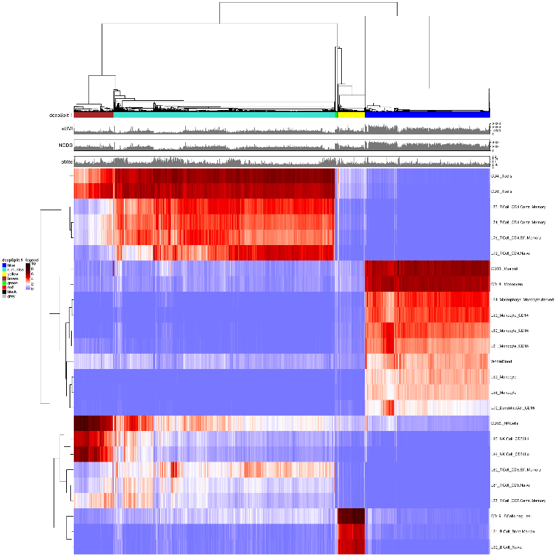

In addition to the visuzalization in the heatmap, it can make sense to look at the projection using a UMAP.
To do so, simple use the functions

```R
PBMCs<-computeUMAP(PBMCs)
RCAv2::plotRCAUMAP(PBMCs,filename = "UMAP_PBMCs.pdf")
```
The *plotRCAUMAP* returns a list of *ggplot2* objects to allow for simple modification of the generated figures. 

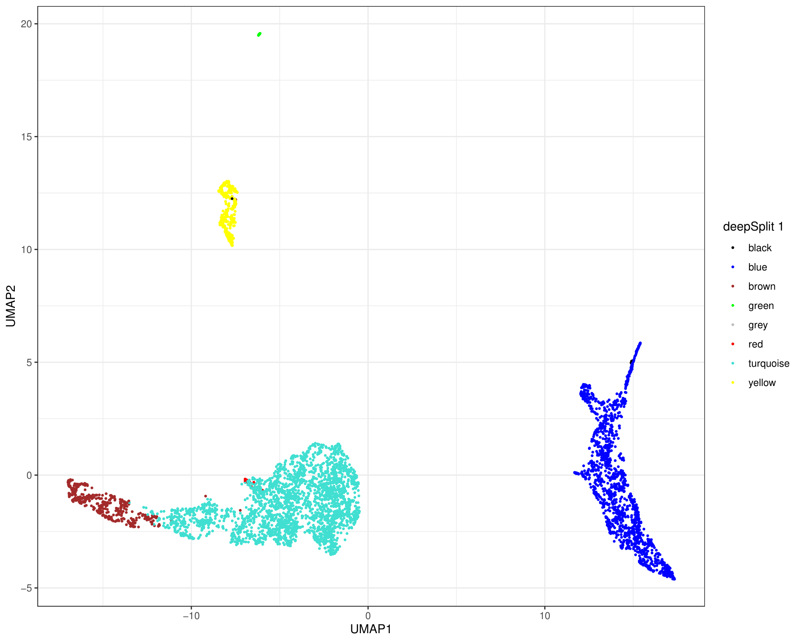

In addition to the standard 2D umaps, RCA also allows the generation of 3D umaps.
```R
PBMCs<-computeUMAP(PBMCs, nDIMS = 3)
RCAv2::plotRCAUMAP3D(PBMCs,filename = "UMAP3D_PBMCs.html")
```
3D umaps are stored as *html* files that can be interactively inspected with any browser. Due to github limitations, only a screenshot is shown below:
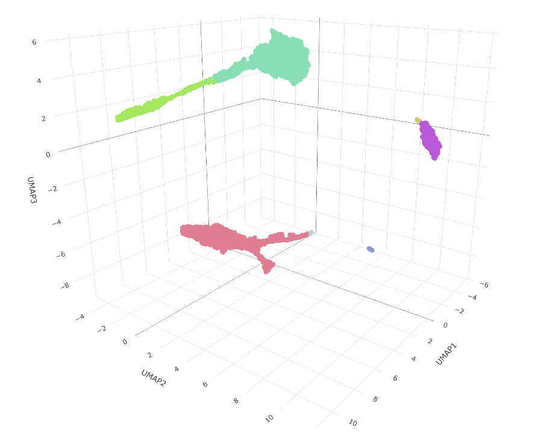


To better understand the composition of each cluster we generate a stacked bar plot Figure using the *plotRCAClusterComposition* function:
```R
#Estimate the most probable cell type label for each cell
PBMCs<-estimateCellTypeFromProjection(PBMCs,confidence = NULL)
#Generate the cluster composition plot
RCAv2::plotRCAClusterComposition(PBMCs,filename="Cluster_Composition.pdf")
```


In a) we show the relative composition of each cluster and b) shows the absolute number of cells in each cluster. The color code indicates the most likely annotation of the cells.

Based on the heatmap as well as the stacked bar plots we can relabel the clusters according to the major cell type annotations:
```R
RCAcellTypes<-PBMCs$clustering.out$dynamicColorsList[[1]]
RCAcellTypes[which(RCAcellTypes=="blue")]<-"Monocytes"
RCAcellTypes[which(RCAcellTypes=="green")]<-"Dentritic cells"
RCAcellTypes[which(RCAcellTypes=="yellow")]<-"B cells"
RCAcellTypes[which(RCAcellTypes=="grey")]<-"B cells"
RCAcellTypes[which(RCAcellTypes=="brown")]<-"NK cells"
RCAcellTypes[which(RCAcellTypes=="turquoise")]<-"T cells"
RCAcellTypes[which(RCAcellTypes=="red")]<-"Myeloid cells"
RCAcellTypes[which(RCAcellTypes=="black")]<-"Progenitor cells"
```

Also, we generate a vector holding the expression of *CD56*, a common NK cell marker. The gene name of *CD56* is NCAM1.

```R
CD56Exp<-PBMCs$data[which(rownames(PBMCs$data)=="NCAM1"),]
```

We can use the RCA plot function to obtain two additional UMAPs that are labelled according to the cell types and the CD56 marker:

```R
RCAv2::plotRCAUMAP(PBMCs,cellPropertyList = list(CellTypes=RCAcellTypes,CD56=CD56Exp),filename = "UMAP_PBMCs.pdf")
```
Each UMAP will be stored in a separate *pdf* where the filename indicates which element from the *cellPropertyList* is depicted in the UMAP.

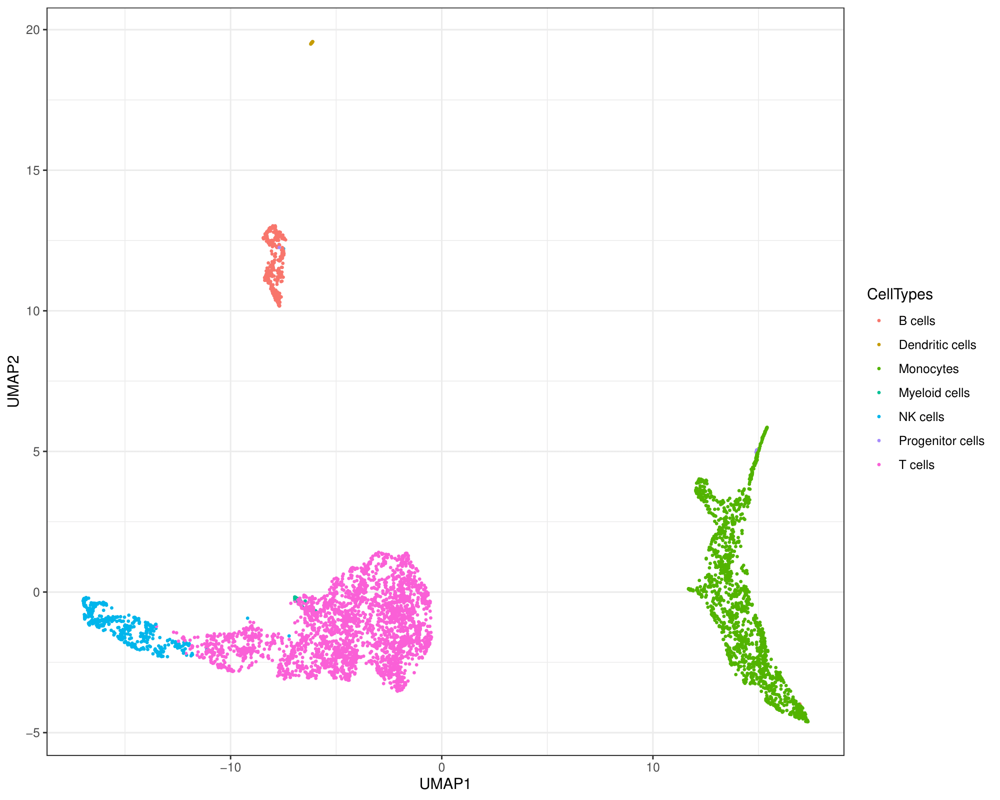


For numerical data, the dots are transparent for low values to avoid overplotting issues. In our example, we can see that *CD56* expression corresponds to the NK annotation.

To obtain a less noisy cell type labelling, cell-types can also be predicted on the cluster level. To this end, RCAv2 carries out a majority vote using the cluster-composition plot mentioned above.
To obtain cluster based cell type predictions, the user can run the function *estimateCellTypeFromProjectionPerCluster*:
```R

PBMCs<-RCAv2::createRCAObjectFrom10X("../Documents/10xExample/")
PBMCs<-RCAv2::dataFilter(PBMCs,nGene.thresholds = c(300,4500),
                  percent.mito.thresholds = c(0.025,0.1),
                  min.cell.exp = 3)
PBMCs<-RCAv2::dataLogNormalise(PBMCs)
PBMCs<-RCAv2::dataProject(PBMCs,
                          method = "NovershternPanel",
                          corMeth = "pearson", 
			  nPCs=0,
			  approx= FALSE)
PBMCs<-RCAv2::dataSClust(PBMCs,res = 0.15)
PBMCs<-estimateCellTypeFromProjectionPerCluster(PBMCs)
```
The figure below shows an example using the PBMC dataset using the Novosthern panel.


### Graph based clustering as an alternative to hierarchical clustering
Due to the increasing size of single cell datasets, hierarchical clustering requires machines with large main memory. To overcome this putative limitation, RCAv2 also offers graph based clustering using a shared neirest neighbour (snn) approach (Halser et al., Journal of Statistical Software, 2019).
To cluster the PBMC projection using the snn approach run
```R
PBMCs<-RCAv2::dataSNN(PBMCs,k=100,eps=25,minPts=30,dist.fun="All",corMeth="pearson")
```
This function has three main parameters:
* *k* as the number of considered neighbours per cell,
* *eps* as the minimum number of shared neighbours between to cells,
* *minPts* minimum number of points that share *eps* neighbours such that a point is considered a core point.

The *dist.fun* parameter controls whether the distance matrix used for SNN clustering is based on the full correlation distance matrix or, if *dist.fun* is set to *PCA*, on a PC reduction of the reference projection. The *corMeth* sets which correlation function is used for the distance computation (pearson (default), spearman or kendal).
As for the hierarchical clustering, heatmaps and umaps can be generated as well.

To help the user choosing the parameters for clustering, we provide a parameter space exploration feature leading to a 3D umap illustrating the number of clusters depending on the three parameters, as shown below. 


This figure can be generated using the function
```R
parameterSpaceSNN(PBMCs,kL=c(30:50),epsL=c(5:20),minPtsL=c(5:10),folderpath=".",filename="Graph_based_Clustering_Parameter_Space.html") 
```
where *kL*, *epsL* and *minPtsL* define the search space for *k*, *eps* and *minPts* respectively. Note that executing this function will take longer for large search spaces.
In addition to those clustering parameters, via the *dist.fun* parameter one can choose whether a PCA reduction of the projection matrix, or the entire projection matrix should be used to construct the snn graph.

### Using Louvain graph clustering implemented in Seurat
As the snn clustering approach mentioned above requires multiple parameteres to be tuned, RCAv2 also allows to cluster cells using the Louvain graph based clustering used in Seurat (Butler et al., Nature Biotechnology, 2018).
To cluster the PBMC projection using Seurat clustering, run:
```R
PBMCs<-dataSClust(PBMCs,res=0.5)
```
where res is the resolution parameter parsed on to the Seurat clustering function. 

Upon graph based clustering, the RCA projection heatmap will be plotted without column dendrogramms.

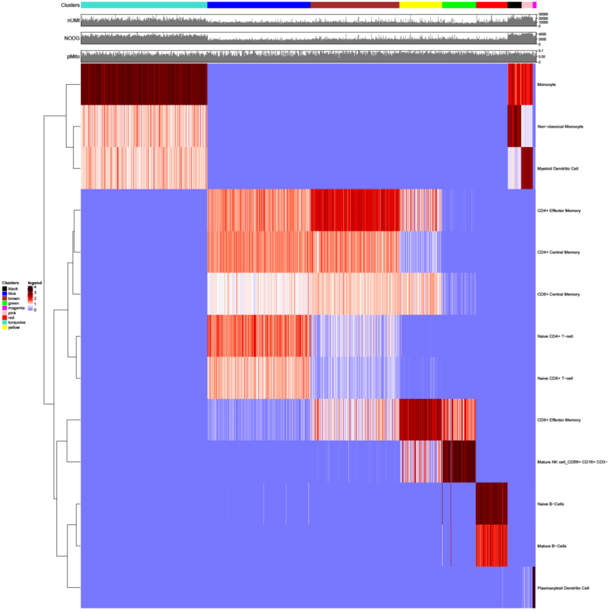

This function uses the same approximation of the PCA as the original Seurat function. Setting *approx* to FALSE will compute the exact PCA. If the *corMeth* parameter is set to either *pearson, spearman* or *kendal*, the function will compute a full distance matrix using correlation distance instead of the default euclidean distance. This can also be combined with the exact PCA. However, not that these options require more memory to be available than the default. With the *elbowPlot* function, an ElbowPlot that guides the selection of the number of PCs to be considered can be generated.

### Clustering free analysis of the projection
Especially for very large datasets it can be challenging to cluster the projection. For these instances, RCA includes a clustering indepent cell-type assignment approach motivated by SingleR and scMatch, that is purely based on each cells z-score distribution based on the reference projection.
A call to the function 
```R
PBMCs<-estimateCellTypeFromProjection(PBMCs,confidence = NULL)
```
will return the most likely cell type for each cell and save it in the PBMCs object. With the parameter *confidence* a threshold (between 0 and 1) can be imposed on the ratio between the two most likely cell-types. In uncertain cases, a cell will be labelled as unkown.

The above call results in the following cell type predictions:
```R
table(unlist(PBMCs$cell.Type.Estimate))

              BDCA4._DentriticCells                     CD14._Monocytes             CD19._BCells.neg._sel.. 
                                 69                                 108                                 307 
                      CD33._Myeloid                               CD34.                         CD4._Tcells 
                               1363                                   3                                2266 
                      CD56._NKCells                         CD8._Tcells                 L45_CMP_Bone.Marrow 
                                458                                 364                                   4 
             L51_B.Cell_Bone.Marrow                        L52_Platelet  
```

Slightly simplifying the annotation via
```R
#Retrieve annotation
SimplifiedAnnotation<-unlist(PBMCs$cell.Type.Estimate)
#Relabel it
SimplifiedAnnotation[which(SimplifiedAnnotation=="CD33._Myeloid")]<-"Myeloid"
SimplifiedAnnotation[which(SimplifiedAnnotation=="CD4._Tcells")]<-"T cells"
SimplifiedAnnotation[which(SimplifiedAnnotation=="CD8._Tcells")]<-"T cells"
SimplifiedAnnotation[which(SimplifiedAnnotation=="CD14._Monocytes")]<- "Monocytes"
SimplifiedAnnotation[which(SimplifiedAnnotation=="BDCA4._DentriticCells")]<-"Dentritic cells"
SimplifiedAnnotation[which(SimplifiedAnnotation=="L93_B.Cell_Plasma.Cell")]<- "B cells"
SimplifiedAnnotation[which(SimplifiedAnnotation=="L52_Platelet")]<-"Myeloid"
SimplifiedAnnotation[which(SimplifiedAnnotation=="L74_T.Cell_CD4.Centr..Memory")]<-"T cells"
SimplifiedAnnotation[which(SimplifiedAnnotation=="L51_B.Cell_Bone.Marrow")]<-"T cells"
SimplifiedAnnotation[which(SimplifiedAnnotation=="L75_T.Cell_CD4.Centr..Memory")]<-"T cells"
SimplifiedAnnotation[which(SimplifiedAnnotation=="L85_NK.Cell_CD56Hi")]<-"NK cells"
SimplifiedAnnotation[which(SimplifiedAnnotation=="CD34.")]<-"Progenitor"
SimplifiedAnnotation[which(SimplifiedAnnotation=="L45_CMP_Bone.Marrow")]<- "Progenitor"
SimplifiedAnnotation[which(SimplifiedAnnotation=="WholeBlood")]<- "Myeloid"
SimplifiedAnnotation[which(SimplifiedAnnotation=="L69_Dendritic.Cell_Monocyte.derived")]<- "Myeloid"
SimplifiedAnnotation[which(SimplifiedAnnotation=="L80_T.Cell_CD8.Eff..Memory")]<-"T cells"
SimplifiedAnnotation[which(SimplifiedAnnotation=="L60_Monocyte_CD16")]<- "Monocytes"
SimplifiedAnnotation[which(SimplifiedAnnotation=="L86_NK.Cell_CD56Lo")]<-"NK cells"
SimplifiedAnnotation[which(SimplifiedAnnotation=="L73_T.Cell_CD4.Naive")]<-"T cells"
SimplifiedAnnotation[which(SimplifiedAnnotation=="CD56._NKCells")]<-"NK cells"
SimplifiedAnnotation[which(SimplifiedAnnotation=="CD19._BCells.neg._sel..")]<- "B cells"
```
and plotting a new UMAP with
```R
umapFigures<-RCAv2::plotRCAUMAP(PBMCs,
                      cellPropertyList = list(`Cell Type`=SimplifiedAnnotation),
                      filename = "UMAP_PBMCs.pdf")
```
leads us to a clustering free cell type assignment.

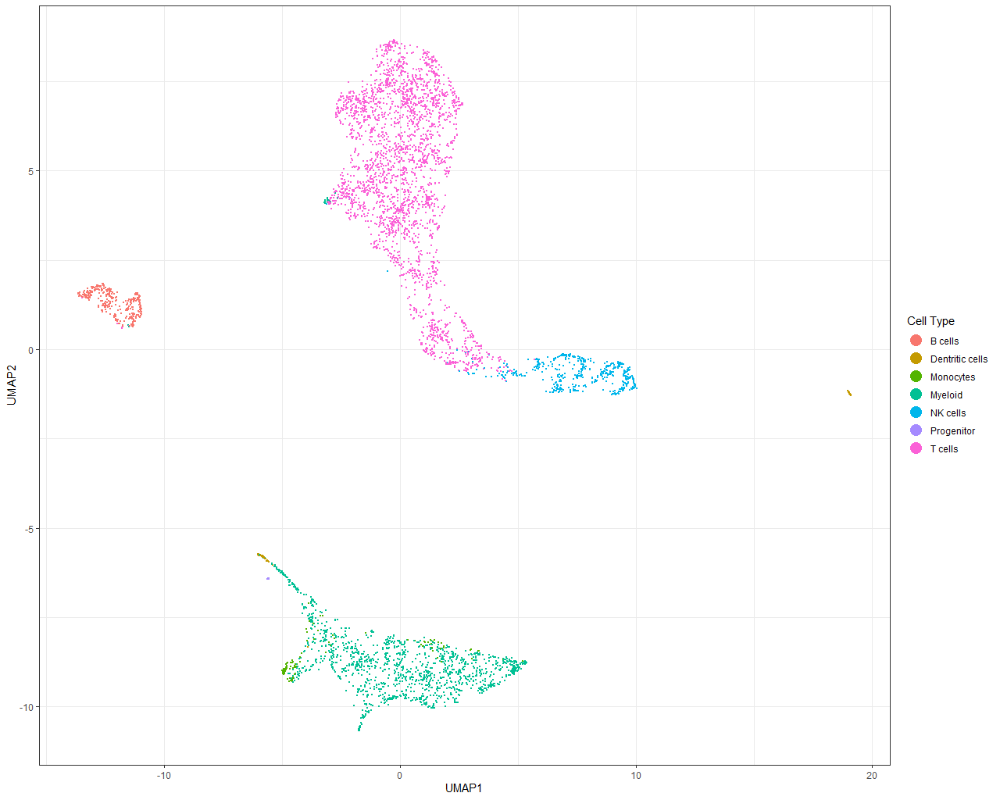

### Compute DE genes for RCA clusters
To ease cluster interpretation further, RCAv2 allows the user to compute pairwise DE genes for all identified clusters.
Computation can be initiated with the command:
```R
PBMCs<-RCAv2::dataDE(PBMCs,
  logFoldChange = 1.5,
  method = "wilcox",
  mean.Exp = 0.5,
  deep.Split.Values = 1,
  min.pct = 0.25,
  min.diff.pct = -Inf,
  random.seed = 1,
  min.cells.group = 3,
  pseudocount.use = 1,
  p.adjust.methods = "BH",
  top.genes.per.cluster = 10
)
```
Here, *logFoldChange* is the required logFoldChange to call a gene to be differentially expressed. The *method* parameter indicates which statistical test is used. Multiple test correction is perfomed using the method indicated in *p.adjust.methods*.
The parameters *mean.Exp* and *min.pct* indicat the minimum expression value as well as the minimum percentage of cells expressing a gene. Furthermore, the pseudocount
can be adjusted via the *pseudocount.use* parameter. The *top.genes.per.cluster* parameter indicats how many genes should be selected as top DE genes per pairwise comparison for each cluster.
Both the entire set of DE genes as well as the top DE genes are stored in the PBMCs *rca.obj*.
The topDE genes can be plotted in a heatmap via the *plotDEHeatmap* function:
```R
RCAv2::plotDEHeatmap(PBMCs,scale=FALSE)
```
The *scale* parameter allows the user to plot either the normalized UMI counts or scaled count (z-transformed). An example is shown below.

### Compute enrichment for GO terms and KEGG pathways
Using the *clusterProfiler* package, RCAv2 supports enrichment tests for GO terms and KEGG pathways using the
functions *doEnrichGo* and *doEnrichKEGG*, respectively. Both require the parameter *annotation* to be set, which
is needed both for ID mapping and GO-term assignment. An example for an annotation for human is the *org.Hs.eg.db* available at
Bioconductor.

To compute GO enrichment for all identified RNA-seq clusters, call the function:
```R
doEnrichGo<-function(rca.obj,
                    annotation=NULL,
                    ontology="BP",
                    p.Val=0.05,
                    q.Val=0.2,
                    p.Adjust.Method="BH",
                    gene.label.type="SYMBOL",
                    filename="GoEnrichment.pdf",
		    background.set="ALL",
                    background.set.threshold=NULL,
                    n.Cells.Expressed=NULL,
                    cluster.ID=NULL,
                    deep.split=NULL)
```
where ontology is either *BP, MF* or *CC*, *p.Val* and *q.Val* are thresholds used by clusterprofiler, and *p.Adjust.Method* indicates which method is used to correct for multiple testing.
For greater user convenience, the function automatically maps geneIDs. To this end, the *gene.label.type* holds the type of the original labels. In concordance with 10X data, this is set to SYMBOL by default. 
The background set is either based on all clusters or only on the investigated one. Cells are selected either via the *background.set.threshold* or the *n.Cells.Expressed" parameter. Note that the former is either a numerical value or one of the following: Min, 1stQ, Mean, Median, 3thQ. Those thresholds are computed for the distribution of all mean expression values of all genes.
The parameter *cluster.ID* can be set if the anaysis should be performed for only one particular cluster, the value of *deep.split* can be specified to select a custom split in case hierarchical clustering has been used.

The doEnrichGo functions generates barplots, goplots and dotplots for each cluster separately. The filenames can be modified using the *filename* parameter. Example barplots and dotplots are shown for a PBMC NK-cell cluster. Goplots are depicted for a PBMC B-cell.

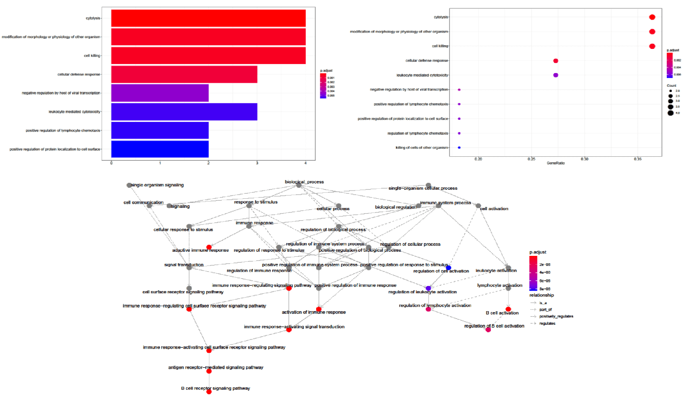


To perform enrichment against KEGG pathways, the *doEnrichKEGG function* can be used:
```R
doEnrichKEGG<-function(rca.obj,
                     annotation=NULL,
                     org="hsa",
                     key="kegg",
                     p.Val=0.05,
                     q.Val=0.2,
                     p.Adjust.Method="BH",
                     gene.label.type="SYMBOL",
                     filename="KEGGEnrichment.pdf",
		     background.set="ALL",
                     background.set.threshold=NULL,
                     n.Cells.Expressed=NULL,
                     cluster.ID=NULL,
                     deep.split=NULL)
```
The parameters are similar to the GO enrichment function except for the *org* parameter, which must represent an organism supported by KEGG. This is set to *hsa* for homo sapiens by default.
Note that the KEGG function does not generate goPlots but only bar- and dotplots. An example for NK cells is shown below.


##Cluster/Cell-type specific quality control
RCAv2 offers straightforward ways to perform cluster-specific quality control. We illustrate this functionality using an inhouse dataset of 45926 cells obtained from five bone marrow samples.
A link to download the data will be made available here at a later stage.
First, we load the data, project it against the global panel and cluster it:
```R
normalBoneMarow<-readRDS("../Documents/DUKE_Normal.RDS")
createRCAObject()
PBMCs<-RCAv2::createRCAObject(normalCML@assays$RNA@data,dataIsNormalized = T)

PBMCs<-RCAv2::dataProject(PBMCs,
                          method = "GlobalPanel",
                          corMeth = "pearson")

PBMCs<-RCAv2::dataSClust(PBMCs,res = 0.1)
RCAv2::plotRCAHeatmap(PBMCs,filename = "Control_HeatmapPostQC.pdf")
```
Based on the following projection heatmap

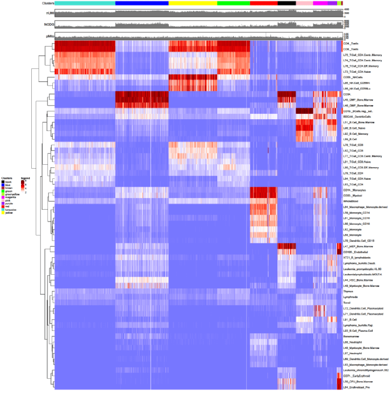

we identify the cluster IDs as:

```R
cellTypes<-c("Progenitor B","CMP/MEP","CMP/GMP","GMP/Dendritic cells","CD8 T cells","NK cells","CD4 T cells", "B cells", "Erythroid Progenitor","Monocytes","BT")
clusterColors<-c("purple","black","blue","magenta","turquoise","yellow","green","pink","greenyellow","red","brown")
names(cellTypes)<-clusterColors
cellTypeLabels<-cellTypes[PBMCs$clustering.out$dynamicColorsList[[1]]]
```
and plot cluster quality scores using
```R
plotClusterQuality(PBMCs,width = 15,height = 9,cluster.labels = cellTypeLabels)
```
where *width* and *height* allow the user to customize plot size.
As shown in the generated scatter plot different clusters require distinct QC parameters:

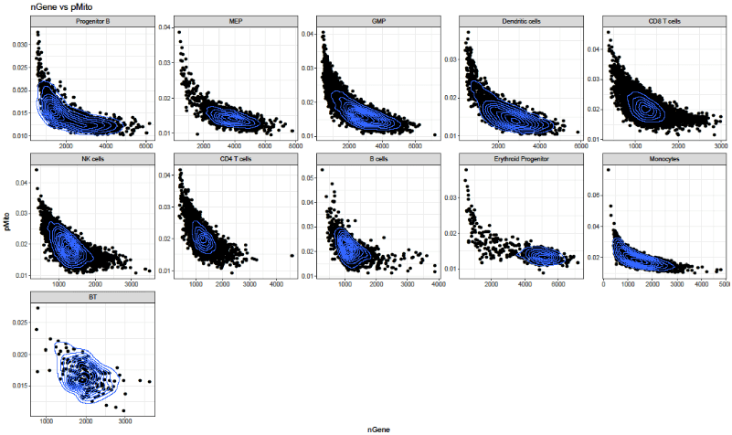

Therefore, we apply cluster specific NODG thresholds:
```R
RCAv2::performClusterSpecificQC(PBMCs,cluster.labels = PBMCs$clustering.out$dynamicColorsList[[1]],
	nGene.low.thresholds = c(500,2000,1000,500,750,750,750,800,3500,500,1250),
	nGene.high.thresholds = c(5000,6000,5000,5000,1800,2000,2000,2000,6500,3000,3000))
```
and replot the QC metrics
```R
plotClusterQuality(PBMCs,width = 15,height = 9,cluster.labels = cellTypeLabels.pdf")
```
resulting in a satisfying, cluster-specific QC.

## Combining RCA with Seurat
Data processing can also be carried out with Seurat. Here is an example how you can combine a RCA analysis with data preprocessed in Seurat.

### Load and preprocess data
Using the same 10x data as before, we generate a Seurat object and perform an initial analysis:

```R
library(Seurat)

#Load the data
PBMCs.10x.data<-Seurat::Read10X("../Downloads/10xExample/",)

#Generate a Seurat object
pbmc_Seurat <- CreateSeuratObject(counts = PBMCs.10x.data$`Gene Expression`, 
                  min.cells = 3, 
                  min.features  = 200, 
                  project = "10X_PBMC", 
                  assay = "RNA")

#Compute the percentage of mitochondrial rates
mito.genes<-grep(pattern="^MT-",x=rownames(pbmc_Seurat@assays[["RNA"]]),value=T)
percent.mito <- Matrix::colSums(pbmc_Seurat@assays[["RNA"]][mito.genes, ])/
                                Matrix::colSums(pbmc_Seurat@assays[["RNA"]])
pbmc_Seurat <- AddMetaData(object = pbmc_Seurat, metadata = percent.mito, col.name = "percent.mito")

#Perform QC using the same parameters as above
pbmc_Seurat <- subset(pbmc_Seurat, nFeature_RNA >300 & nFeature_RNA < 5000 &
                        nCount_RNA > 400 & nCount_RNA<30000 &
                        percent.mito > 0.025 & percent.mito < 0.2)

#Normalize the data
pbmc_Seurat <- NormalizeData(object = pbmc_Seurat, normalization.method = "LogNormalize", scale.factor = 10000)
```

To run RCA, no further processing steps would be needed. However, we want to also compare the RCA result to the Seurat based clustering, therefore we first go on with a Seurat based analysis:
```R

#Find HVGs
pbmc_Seurat <- FindVariableFeatures(object = pbmc_Seurat, 
                   mean.function = ExpMean, 
                   dispersion.function = LogVMR, 
                   x.low.cutoff = 0.0125, 
                   x.high.cutoff = 3, 
                   y.cutoff = 0.5, 
                   nfeatures = 2000)

#Center and scale the data
pbmc_Seurat <- ScaleData(object = pbmc_Seurat)

#Run PCA on the data
pbmc_Seurat <- RunPCA(object = pbmc_Seurat,  npcs = 50, verbose = FALSE)

#Plot different aspsects of the pca
ElbowPlot(object = pbmc_Seurat,ndims = 50)
```

Based on the Elbowplot (not shown here), we use 20 PCs for further analysis. 
```R
#Find Neighbors
pbmc_Seurat <- FindNeighbors(pbmc_Seurat, reduction = "pca", dims = 1:20)

#Find Clusters
pbmc_Seurat <- FindClusters(pbmc_Seurat, resolution = 0.2, algorithm = 1)
```

We generate a UMAP of the data stored in the Seurat object using the umap R package:
```R
#Load required libraries
library(umap)
library(ggplot2)
library(randomcoloR)

#Compute Umap from first 20PCs
umap_resultS<- umap(pbmc_Seurat@reductions$pca@cell.embeddings[,c(1:20)])
umap_resultSL<-as.data.frame(umap_resultS$layout)

#Derive distinguishable colors for the seurat clusters
myColors<-distinctColorPalette(length(unique(pbmc_Seurat$seurat_clusters)))

#Generate a UMAP
umapAll_Seurat_RCA<-ggplot(umap_resultSL,aes(x=V1,y=V2,color=pbmc_Seurat$seurat_clusters))+theme_bw(30)+
  geom_point(size=1.5)+labs(colour="ClusterID")+theme(legend.title = element_text(size=10))+
  guides(colour = guide_legend(override.aes = list(size=4)))+theme(legend.position = "right")+
  theme(legend.text=element_text(size=10))+scale_color_manual(values=myColors)+xlab("UMAP1")+ylab("UMAP2")
umapAll_Seurat_RCA
```
We obtain the following UMAP:
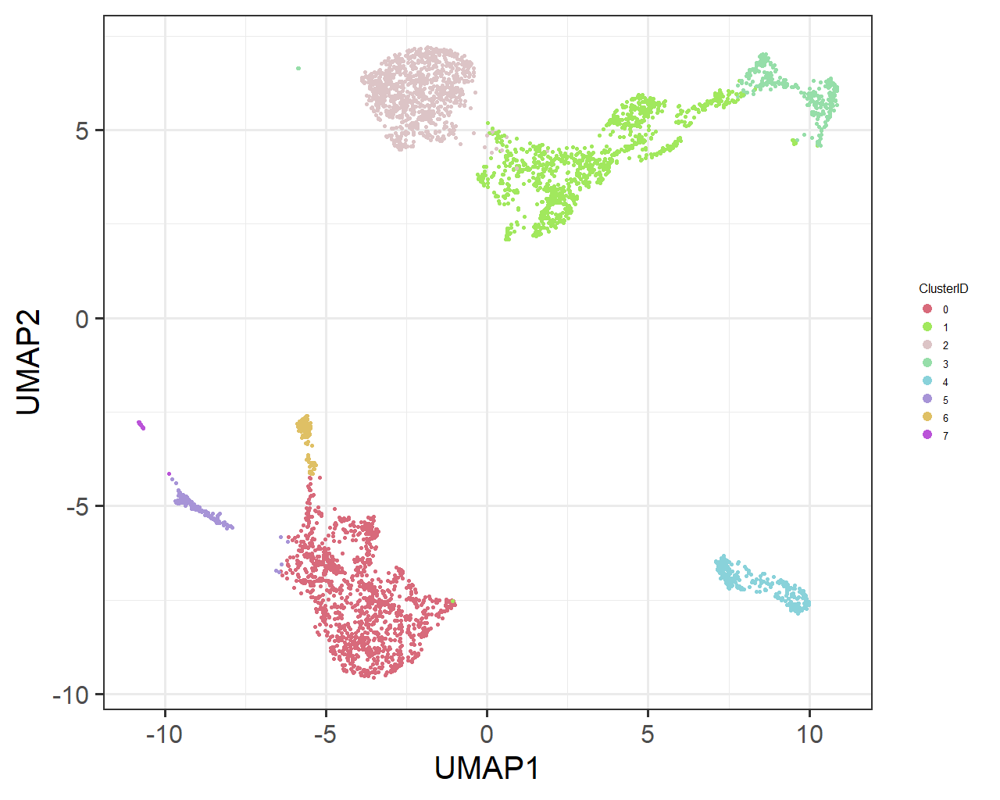

### Generate a RCA object and perform RCA analysis
We use the RCA function *createRCAObject* to generate a RCA object from the raw and optionally also the normalized data stored in our Seurat object.

```R
library(RCAv2)
RCA_from_Seurat<-RCAv2::createRCAObject(pbmc_Seurat@assays$RNA@counts, pbmc_Seurat@assays$RNA@data)
```
Next, we can compute the projection, cluster the data, and estimate the most likely cell type for each cell as above:
```R
#Compute projection
RCA_from_Seurat<-RCAv2::dataProject(rca.obj = RCA_from_Seurat)

#Cluster the projection
RCA_from_Seurat<-RCAv2::dataClust(RCA_from_Seurat)

#Estimate most likely cell type
RCA_from_Seurat<-RCAv2::estimateCellTypeFromProjection(RCA_from_Seurat)
```

Using the RCA cell type labels, RCA and Seurat clusters, we generate two new UMAPs whose coordinates are based on the PCs derived from HVGs and that are colored according to RCA clusters and cell type labels.

```R
#Simplify the cell type annotation
SimplifiedAnnotation<-unlist(RCA_from_Seurat$cell.Type.Estimate)
SimplifiedAnnotation[which(SimplifiedAnnotation=="CD33._Myeloid")]<-"Myeloid"
SimplifiedAnnotation[which(SimplifiedAnnotation=="CD4._Tcells")]<-"T cells"
SimplifiedAnnotation[which(SimplifiedAnnotation=="CD8._Tcells")]<-"T cells"
SimplifiedAnnotation[which(SimplifiedAnnotation=="CD14._Monocytes")]<- "Monocytes"
SimplifiedAnnotation[which(SimplifiedAnnotation=="BDCA4._DentriticCells")]<-"Dentritic cells"
SimplifiedAnnotation[which(SimplifiedAnnotation=="L93_B.Cell_Plasma.Cell")]<- "B cells"
SimplifiedAnnotation[which(SimplifiedAnnotation=="L52_Platelet")]<-"Myeloid"
SimplifiedAnnotation[which(SimplifiedAnnotation=="L74_T.Cell_CD4.Centr..Memory")]<-"T cells"
SimplifiedAnnotation[which(SimplifiedAnnotation=="L51_B.Cell_Bone.Marrow")]<-"T cells"
SimplifiedAnnotation[which(SimplifiedAnnotation=="L75_T.Cell_CD4.Centr..Memory")]<-"T cells"
SimplifiedAnnotation[which(SimplifiedAnnotation=="L85_NK.Cell_CD56Hi")]<-"NK cells"
SimplifiedAnnotation[which(SimplifiedAnnotation=="CD34.")]<-"Progenitor"
SimplifiedAnnotation[which(SimplifiedAnnotation=="L45_CMP_Bone.Marrow")]<- "Progenitor"
SimplifiedAnnotation[which(SimplifiedAnnotation=="WholeBlood")]<- "Myeloid"
SimplifiedAnnotation[which(SimplifiedAnnotation=="L69_Dendritic.Cell_Monocyte.derived")]<- "Myeloid"
SimplifiedAnnotation[which(SimplifiedAnnotation=="L80_T.Cell_CD8.Eff..Memory")]<-"T cells"
SimplifiedAnnotation[which(SimplifiedAnnotation=="L60_Monocyte_CD16")]<- "Monocytes"
SimplifiedAnnotation[which(SimplifiedAnnotation=="L86_NK.Cell_CD56Lo")]<-"NK cells"
SimplifiedAnnotation[which(SimplifiedAnnotation=="L73_T.Cell_CD4.Naive")]<-"T cells"
SimplifiedAnnotation[which(SimplifiedAnnotation=="CD56._NKCells")]<-"NK cells"
SimplifiedAnnotation[which(SimplifiedAnnotation=="CD19._BCells.neg._sel..")]<- "B cells"

#Plot a umap colored by the simplified cell type labels
myColors<-distinctColorPalette(length(unique(SimplifiedAnnotation)))
umapAll_Seurat_Estimated_CT<-ggplot(umap_resultSL,
aes(x=V1,y=V2,color=SimplifiedAnnotation))+
theme_bw(30)+
geom_point(size=1.5)+
theme(legend.position = "bottom")+
labs(colour="Cell type")+
guides(colour = guide_legend(override.aes = list(size=4)))+
theme(legend.text=element_text(size=10))+
scale_color_manual(values=myColors)+
ggtitle("b)")+
xlab("UMAP1")+ylab("UMAP2")+
theme(legend.title = element_text(size=12))

#Plot a umap colored by the RCA cluster ID
umapAll_Seurat_RCA_Clusters<-ggplot(umap_resultSL,
aes(x=V1,y=V2,color=RCA_from_Seurat$clustering.out$dynamicColorsList[[1]]))+
theme_bw(30)+
geom_point(size=1.5)+
theme(legend.position = "bottom")+
labs(colour="RCA Cluster ID")+
guides(colour = guide_legend(override.aes = list(size=4)))+
theme(legend.text=element_text(size=10))+
xlab("UMAP1")+ylab("UMAP2")+
scale_color_identity(guide=guides(color=RCA_from_Seurat$clustering.out$dynamicColorsList[[1]]))+
ggtitle("a)")+
theme(legend.title = element_text(size=12))

#Combine the Figures into one
library(gridExtra)
grid.arrange(umapAll_Seurat_RCA_Clusters,umapAll_Seurat_Estimated_CT,nrow=1)
```

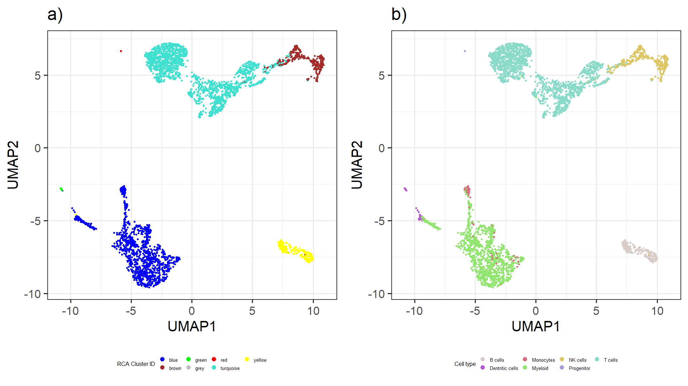

The RCA clusters show a high concordance to the Seurat clusters shown in the previous UMAP.

### Add projection and annotations to the Seurat object
For greater convenience the results of RCA can be saved within the Seurat object for further analysis.

```R
pbmc_Seurat[["RCA.clusters"]]<-RCA_from_Seurat$clustering.out$dynamicColorsList
pbmc_Seurat[["cellTypeLabel"]]<-RCA_from_Seurat$cell.Type.Estimate
pbmc_Seurat[["Projection"]]<-CreateAssayObject(data=RCA_from_Seurat$projection.data)
```

### Add a UMAP based on the projection to the Seurat object
Also, a UMAP reduction based on the projection space can be added to the Seurat object:
```R
RCA_from_Seurat<-computeUMAP(RCA_from_Seurat)
pbmc_Seurat[["RCA_umap"]]<-CreateDimReducObject(embeddings=as.matrix(RCA_from_Seurat$umap.coordinates),key="RCA_umap_",assay=DefaultAssay(pbmc_Seurat))
```


## Visualizing RNA velocity on RCA result

RNA velocity describes the rate of gene expression change for an individual gene at a given time point based on the ratio of its spliced and unspliced messenger RNA (mRNA). Here, we describe how one can use the [scvelo](https://scvelo.readthedocs.io/) package, in Python, to visualize RNA velocity on the RCA generated result.

To transfer spliced RNA counts to scvelo, first transpose the raw RCA data matrix to get a cells x genes matrix, and export it to a CSV file.

```R
# R
raw.data.counts <- t(rca_obj$raw.data)
write.table(x = raw.data.counts, file = "raw_counts.csv", append = FALSE, quote = FALSE, sep = ",")
```


In addition, export the RCA projection and UMAP embeddings to respective CSV files too.

```R
# R
projection.data <- as.matrix(t(rca_obj$projection.data[, -doublet_index]))
write.table(x = projection.data, file = "projection_data.csv", append = FALSE, quote = FALSE, col.names = F, row.names = F, sep = ",")

umap.data <- as.matrix(rca_obj$umap.coordinates)
write.table(x = umap.data, file = "umap_data.csv", append = FALSE, quote = FALSE, col.names = F, row.names = F, sep = ",")
```

[Create an iPython notebook](https://www.dataquest.io/blog/jupyter-notebook-tutorial/) in the same folder and import the required packages as below.

```Python
# Python
import scvelo as scv
import scanpy as sc
import numpy as np
import pandas as pd
scv.set_figure_params()
```

Then, create a Scanpy object using the raw counts from the CSV file.

```Python
# Python
adata = sc.read_csv(filename='raw_counts.csv')
```

Populate the PCA slot in the Scanpy object as the projection data from RCA.

```Python

# Python
projection_data = np.loadtxt('bm_input/projection_data.csv',delimiter=',')
projection_data.shape

adata.obsm['X_pca'] = projection_data
```

Populate the UMAP slot in the Scanpy object as the umap coordinates from RCA.

```Python
# Python
umap_data = np.loadtxt('bm_input/umap_data.csv',delimiter=',')
umap_data.shape

adata.obsm['X_umap'] = umap_data
```

Load the unspliced loom object generated by [velocyto](http://velocyto.org/).

```Python
# Python
ldata = scv.read('merged.loom', cache=True)
```

Then, merge the spliced and unspliced objects together as described below:

```Python
# Python
merged_data = scv.utils.merge(adata, ldata)
```

As recommended by the scvelo tutorial, perform the following steps to compute RNA velocity:

```Python
# Python
scv.pp.filter_and_normalize(merged_data)
scv.pp.moments(merged_data)
scv.tl.velocity(merged_data, mode='stochastic')
scv.tl.velocity_graph(merged_data)
```

It is possible that not all barcodes had sufficient quality of both spliced and unspliced reads, and thus some cells may have been discarded during the merging process. To ensure your cell type labels are still maintained, export the merged data observations from the merged scvelo object to a CSV file.

```Python
# Python
merged_data.obs.to_csv('merged_data_obs.csv')
```

In R, load this CSV file in and extract the RCA labels and filter only those which were considered in the merged data by scvelo.

```R
# R
merged_data_obs <- read.csv(file = "merged_data_obs.csv", row.names = 1)
rca_clusters <- rca_obj$clustering.out$dynamicColorsList$Clusters
names(rca_clusters) <- colnames(rca_obj$raw.data)
rca_clusters <- rca_clusters[rownames(merged_data_obs)]
```
**Note: If your cell names have underscores in them, scanpy will automatically split the cell name into barcode and sample_batch.**

In this case, replace the last line of the above block of code with the following:

```R
# R
merged_barcodes <- paste0(merged_data_obs$sample_batch, rownames(merged_data_obs))
rca_clusters <- rca_clusters[merged_barcodes]
```

Now export these cluster labels to a CSV file.

```R
# R
rca_cluster_df <- data.frame(Clusters = rca_clusters)
write.table(x = rca_cluster_df, file = "rca_cluster_df.csv", append = FALSE, quote = FALSE, col.names = T, row.names = F, sep = ",")
```

Back in the scvelo iPynb, load this RCA cluster annotation table and set it as the observation slot of your merged data.

```Python
# Python
rca_clusters = pd.read_csv('rca_cluster_df.csv')
merged_data.obs = rca_clusters
```

Now, it's finally time to visualize the RNA velocity results. There are 3 visualization options provided by scvelo, namely velocity_embedding, velocity_embedding_grid and velocity_embedding_stream. Use them as demonstrated below

```Python
# Python
### Velocity embedding
scv.pl.velocity_embedding(merged_data, basis='umap', color = ['Clusters'], legend_loc = 'right margin', palette = 'tab20', figsize = (10,10), save = 'embedding.png')
```

{width=100%}
### Using RCA colors

Since the RCA clusters already have color annotations, you can use the RCA colors in the palette as described below:

```Python
# Python
### Velocity embedding
scv.pl.velocity_embedding(merged_data, basis='umap', color = ['Clusters'], legend_loc = 'right margin', palette = merged_data.obs['Clusters'].sort_values().unique().tolist(), figsize = (10,10), save = 'RCAColor_embedding.png')
```


## FAQ
**What is the difference between the original RCA version (Li et al., Nat Genet, 2017) and RCA version 2?**

*RCA version 2 improves upon version 1 in terms of performance, applicability, functionality and usability. We reimplented the algorithm more efficiently and use faster packages. We considerably extended the included reference data sets and provide new ways of cluster free cell type annotation for large data sets and added graph based clustering in addition to the previously used hierachical clustering. Also the automated generation of figures has been improved to scale better with the size of current data sets.*

**The clustering is very slow (or it doesn't work at all), what can I do?**

*First make sure you are indeed using RCA version 2. Secondly you may check whether you want to cluster cells in PC space and avoid to compute a full distance matrix. Also consider to run RCA on a compute cluster or in the cloud using a machine with large main memory.*

**The cell-type I am interested in are not part of the provided panels, can I generate and use my own reference data set in RCA?**

*Yes you can. Any custom panel can be considered in RCA. An example is shown above.*

**I do not have 10X data, can I just use a count matrix as input for RCA?**

*Yes, that is possible as well. You can generate a RCA object from a custom count matrix using. Guidelines are provided above (Compute a projection to a reference data set)*
