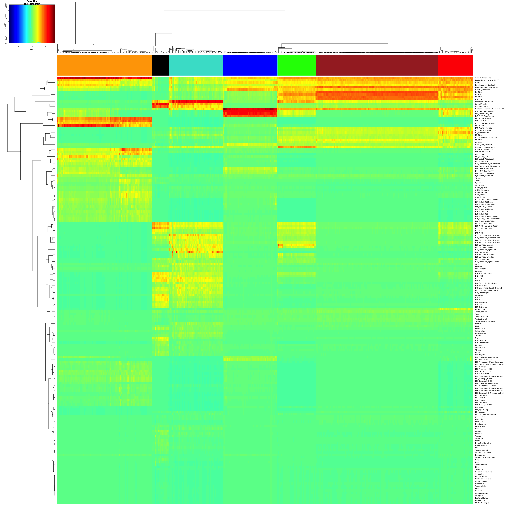

# Analyzing scRNAseq data with RCA
Author: Huipeng Li

date: 20/03/2017

## Introduction

In this tutorial, RCA will be applied to analyze two single cell RNAseq datasets from a recent publication (http://dx.doi.org/ 10.1038/ng.3818). The input data can be downloaded from Gene Expression Omnibus (GEO) with accession GSE81861. The corresponding raw sequencing data can be accessible on European Genome Phenome Archive (EGA) under accession EGAS00001001945. 

## Section 0: Preparing environment and data

A few libraries need to be loaded before running RCA.

```{r,prep,message=FALSE,warning = FALSE,include=TRUE, cache=FALSE}
### loading libraries
library(WGCNA)
library(flashClust)
library(gplots)
library(preprocessCore)
library(RCA)

### setting options
options(stringsAsFactors = FALSE)
```

Download the expression data from GEO and save them in the working directory. Then read the csv files into R as data frames. 

```{r import, message=FALSE,warning = FALSE,include=TRUE, cache=FALSE}
data_cellline = read.csv("../data/GSE81861_Cell_Line_FPKM.csv",row.names=1);
# data_NM_all = read.csv("../data/GSE81861_CRC_NM_all_cells_FPKM.csv",row.names=1);
# data_tumor_all = read.csv("../data/GSE81861_CRC_tumor_all_cells_FPKM.csv",row.names=1);
# data_NM_epi = read.csv("../data/GSE81861_CRC_NM_epithelial_cells_FPKM.csv",row.names=1);
# data_tumor_epi = read.csv("../data/GSE81861_CRC_tumor_epithelial_cells_FPKM.csv",row.names=1);
```

## Section 1: Clustering a cellline dataset involving multiple cell types and multiple batches. 

Define the input dataset, and extract color code from column names. 

```{r cellline1,message=FALSE,warning = FALSE,include=TRUE, cache=FALSE}
fpkm_data = data_cellline;
color_to_use0 = colnames(fpkm_data);
color_to_use0 <- strsplit(color_to_use0,"__");
color_to_use <- paste("",lapply(color_to_use0,"[[",3),sep="");
color_to_use=gsub("\\.","#",color_to_use);
```

Run RCA analysis. 

```{r cellline2,message=FALSE,warning = FALSE,include=TRUE, cache=FALSE}
### construct data object
data_obj = dataConstruct(fpkm_data);
### filt out lowly expressed genes
data_obj = geneFilt(obj_in = data_obj);
### normalize gene expression data (Note: default is no normalization).
data_obj = cellNormalize(data_obj);
### log transform the data
data_obj = dataTransform(data_obj,"log10");
### project the expression data into Reference Component space
data_obj = featureConstruct(data_obj,method = "GlobalPanel");
### generate cell clusters
data_obj = cellClust(data_obj);
```

Plot RCA results. 

```{r cellline3,message=FALSE,warning = FALSE,include=TRUE, cache=FALSE}
RCAPlot(data_obj,cluster_color_labels = color_to_use);
```

Fig1A and Fig1B show the scatter plot and heat map of RCA clusters, labeled with predefined cell types (colors).


*Fig 1A: RCA clusters of cell line data in PCA space. Each color represents one cell type.*



*Fig 1B: Heat map showing reference component scores, with rows representing reference components and columns representing single cells.*


